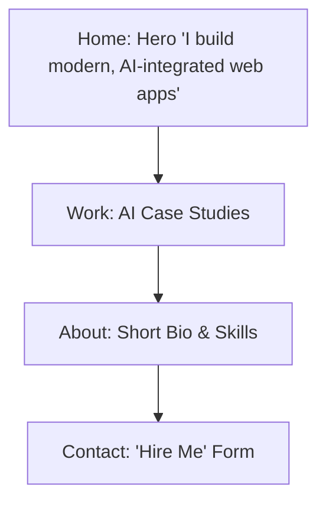

# Portfolio Sitemap & Pressure Test

## 1. Sitemap Sketch
Our goal: Guide the user from landing to believing the claim, and finally to the action (Contact).

## 2. Toolkit Setup
- [x] Accounts set up for Claude (Antigravity), ChatGPT, Gemini, and Perplexity.

## 3. Custom Instructions Update
The Antigravity custom instructions have been updated to include the proof statement and a request for it to act as a tutor for the next eight weeks. *(See `.gemini/rules/custom_instructions.md`)*

## 4. Pressure-Test Prompt & Output

**My Prompt:**
> "Here is my portfolio sitemap: Home -> Work -> About -> Contact. My main claim is 'I build modern, AI-integrated web applications' and my desired user action is 'Contact me for freelance work'. Can you pressure-test this sitemap? Does every page earn its place? What should I change?"

**AI Output (Pressure Test Result):**
> "Your sitemap is generally well-structured, but it can be optimized for your single action. The 'About' page might be an unnecessary detour. When a client sees your work and believes your claim, they should be immediately prompted to act. 
> 
> **Recommendation to change:** Merge the 'About' section into the 'Home' or 'Work' page to keep the site leaner. Add direct 'Contact Me' call-to-action buttons on the 'Home' and 'Work' pages so they don't have to navigate to a dedicated 'Contact' page just to reach out."

**My Note on what to change:** 
I will merge the 'About' section into the Home page, and add CTA buttons directly on the Work page to shorten the path to the contact form.
